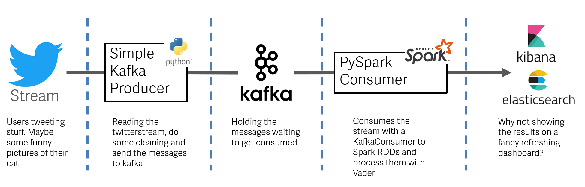
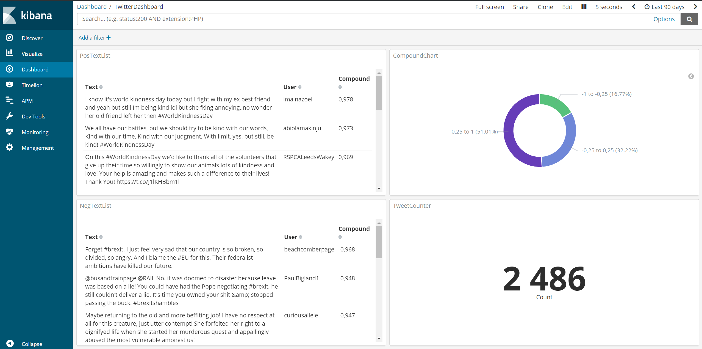

# Twitterstream Sentiment-Analysis with Kafka, Spark & Elasticsearch
Reading the Twitterstream from the Twitter-API with Kafka and stream them into a Spark-Cluster to process it

# Things you need

* Installed [Apache Kafka](https://kafka.apache.org/)
* Installed [Apache Spark](https://spark.apache.org/)
* Installed [Elasticsearch & Kibana](https://www.elastic.co/de/) (If you want to)

Twitter Modules
* Tweepy (And your own pair of API Keys from Twitter)
* Kafka-Python
* Pyspark
* Elasticsearch 
* NLTK with VADER

# Base Architecture

Let's dive into the Base Architecture to get an overview of the tools. It's not that complicated.

</br>

At the beginning of our journey we have the twitterusers tweeting some posts with some hashtags. Roumors says there are ~6000 per second.
Twitter offers an API to query them in past for some days or to read the livestream. 

With a Kafka Producer written in Python (use Java or Scala if you want to) we reading the stream and after some cleaning we send the relevant part of the tweet to a topic at the Kafkaserver. 

While the tweets getting send to the topic the Spark-Consumer waits at the other side of the Kafka Messagequeue. The Spark-Streaming libary has some KafkaUtils to collect the messages from the Kafkaserver and return them into Spark RDDs to process them.

Inside the Spark-Consumer we let the NLTK Vader package doing the Sentiment-Magic and add that result to the data of the tweet.

In the end of a consumingloop we can send the data to Elasticsearch to build some fancy dashboards with Kibana to show the result of our sentimentanalysis and proof that the tweets are beeing processed in realtime.


# Step 1/2 - Read the stream

To swim with the twitterstream we need some tools:

* your personal API-Token you can get from Twitter to call the API
* the Python module Tweepy to access the Stream from Python 
* Kafka-Python module to send the tweets to the Kafkaserver

You can find the code here [twitterstreamproducer.py](/code/twitterstreamproducer.py)

At first we define a StdOutListener who listenes on the Stream the function *on_data()* defines what we want to do with every tweet we get. The function *cleantweet()* cleans every tweet by just extracting the user, date and the text.
After this the tweet is send to the topic "tweets".

```python
class StdOutListener(StreamListener):
    def on_data(self, data):
        newdata = cleantweet(data)
        producer.send("tweets", newdata)
        print(newdata)
        return True
    def on_error(self, status):
        print (status)
```
        
Besides the API-Token we give the Tweepy Stream object our StdOutListener and set a filter to some hashtag we want to track. That's it.
```python
producer = KafkaProducer(bootstrap_servers='YourHostWithKafka:9092', 
    api_version=(0, 10, 1),
    value_serializer=lambda m: json.dumps(m).encode('ascii'))

l = StdOutListener()
auth = OAuthHandler(consumer_key, consumer_secret)
auth.set_access_token(access_token, access_token_secret)
stream = Stream(auth, l,tweet_mode='extended')
stream.filter(track=["#worldkidnessday"], languages=["en"])
```

# Step 2/2 - Consume the tweets

To consume the tweets we can use a boring Python Kafka-Consumer or a cool PySpark-Consumer processing the tweets inside a cluster.
The code of the second option you can find inside [twittersparkconsumer.py](/code/twittersparkconsumer.py).


First of all we create a SparkContext with our appName, then we create the StreamingContext with the SparkContext an let it wait for 3 seconds to consume the next package of tweets. After that we use the StreamingContext to build a KafkaConsumer and for each RDD we get from the Stream we call the function *process()*.
As long as we don't kill the process tis code will run to infinity (and beyond).
```python
sc = SparkContext(appName="PythonStreaming")
ssc = StreamingContext(sc, 3)
  
kafkaStream = KafkaUtils.createStream(ssc, "YourHostWithKafka:2181", "consumer-group", {"tweets": 1})
lines = kafkaStream.map(lambda x: json.loads(x[1]))

lines.foreachRDD(process)

ssc.start()
ssc.awaitTermination()
```
  
Inside the *process()* function we process the tweets and for every tweet we call the *dosentiment()* function othergiving the text of the tweet. The result of this function will added to the data as column "sentiment".

```python
udf_func = udf(lambda x: dosentiment(x),returnType=StringType())
df = df.withColumn("sentiment",lit(udf_func(df.text)))
```

Inside the *dosentiment()* function we processing the text of the tweet with the SentimentAnalyzer of NLTK Vader, which gives us some scores other the positive,negative and neutral elements of the text and a calculated compoundscore from -1 (Negative) to 1 (Positive) and between. These information can be added returned to the tweetdata 

```python
def dosentiment(tweet):
  scores = dict([('pos', 0), ('neu', 0), ('neg', 0), ('compound', 0)])
  sid = SentimentIntensityAnalyzer()
  ss = sid.polarity_scores(tweet)
  for k in sorted(ss):
      scores[k] += ss[k]

  return json.dumps(scores)
 ```
      
Still inside the *process()* function we can now send our result to elasticsearch and build a dashboard with kibana.
The *sth2elastic()* function out of my [ownelastic.py](/code/ownelastic.py) will do the job for us but don't forget to config your Elastichost in this file.

```python
results = df.toJSON().map(lambda j: json.loads(j)).collect()
for result in results:
      result["date"]= datetime.strptime(result["date"],"%Y-%m-%d %H:%M:%S")
      result["sentiment"]=json.loads(result["sentiment"])
      sth2elastic(results,"tweets","doc")
```

Now the Tweets are saved inside the "tweets" Index of Elasticsearch and you can build a dashboard that refreshes every few seconds.

</br>

